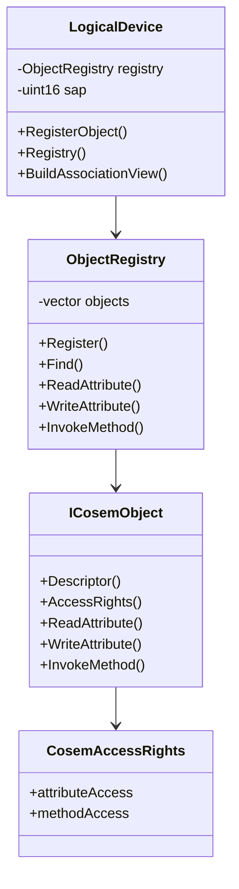

# dlms-cosem API

## 1. Public Headers

Planned phase 1 headers:

```text
include/dlms/cosem/cosem_status.hpp
include/dlms/cosem/cosem_types.hpp
include/dlms/cosem/cosem_object.hpp
include/dlms/cosem/object_registry.hpp
include/dlms/cosem/logical_device.hpp
```

No C ABI is planned for the first implementation.

## 2. Status

`CosemStatus` shall be a stable status contract:

- `Ok`
- `InvalidArgument`
- `DuplicateObject`
- `ObjectNotFound`
- `AttributeNotFound`
- `MethodNotFound`
- `AccessDenied`
- `OutputBufferTooSmall`
- `UnsupportedFeature`
- `ObjectError`
- `InternalError`

## 3. Types

`CosemLogicalName` is a six-byte logical-name value.

`CosemObjectKey` contains:

- `classId`
- `logicalName`

`CosemObjectDescriptor` contains:

- `classId`
- `version`
- `logicalName`

`CosemAttributeDescriptor` contains:

- `object`
- `attributeId`

`CosemMethodDescriptor` contains:

- `object`
- `methodId`

`CosemByteBuffer` is the first-phase encoded xDLMS data container.

## 4. Access Rights

`AttributeAccessMode`:

- `NoAccess`
- `ReadOnly`
- `WriteOnly`
- `ReadAndWrite`
- `AuthenticatedReadOnly`
- `AuthenticatedWriteOnly`
- `AuthenticatedReadAndWrite`

`MethodAccessMode`:

- `NoAccess`
- `Access`
- `AuthenticatedAccess`

`CosemAccessRights` contains attribute and method access entries for one
object. The first implementation stores explicit entries only; missing entries
mean no access.

## 5. Object Interface

```cpp
class ICosemObject
{
public:
  virtual ~ICosemObject();
  virtual CosemObjectDescriptor Descriptor() const = 0;
  virtual CosemAccessRights AccessRights() const = 0;
  virtual CosemStatus ReadAttribute(
    std::uint8_t attributeId,
    CosemByteBuffer& output) const = 0;
  virtual CosemStatus WriteAttribute(
    std::uint8_t attributeId,
    const CosemByteBuffer& input) = 0;
  virtual CosemStatus InvokeMethod(
    std::uint8_t methodId,
    const CosemByteBuffer& input,
    CosemByteBuffer& output) = 0;
};
```

## 6. Registry API

```cpp
ObjectRegistry registry;
registry.Register(object);

const ICosemObject* object = registry.Find(key);
registry.ReadAttribute(attribute, output);
registry.WriteAttribute(attribute, input);
registry.InvokeMethod(method, input, output);
registry.BuildAssociationView(view);
```

## 7. Module Diagram


