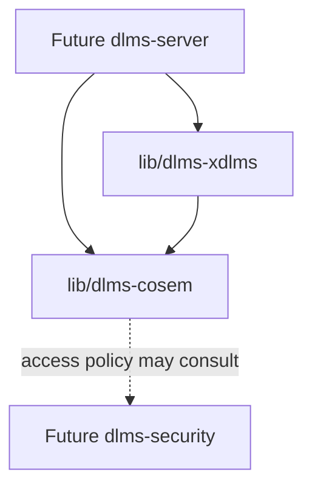
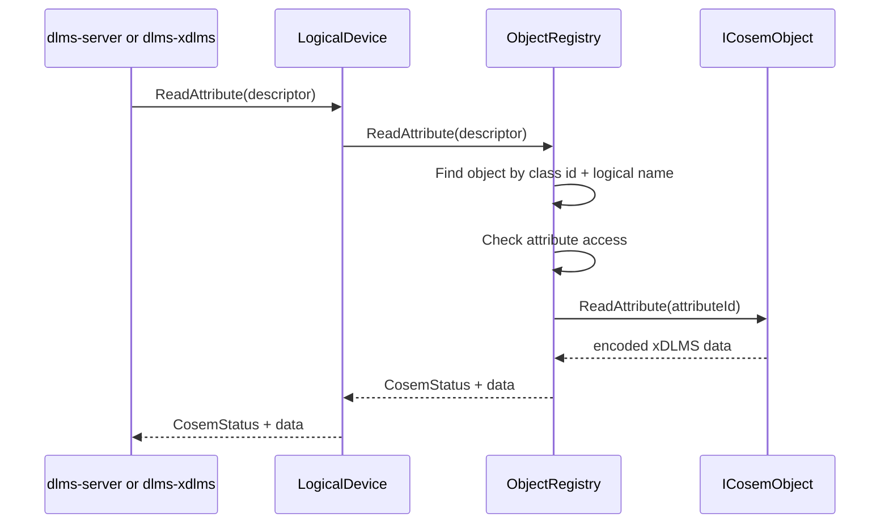
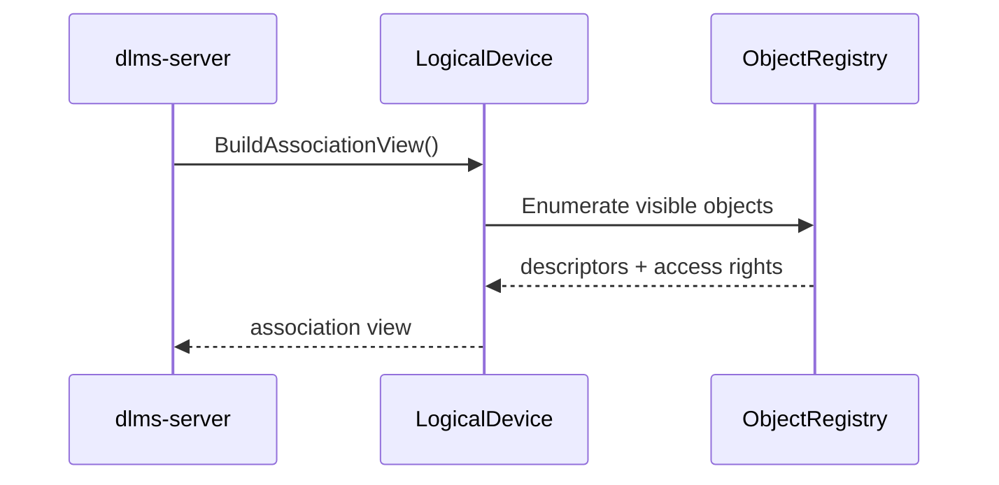
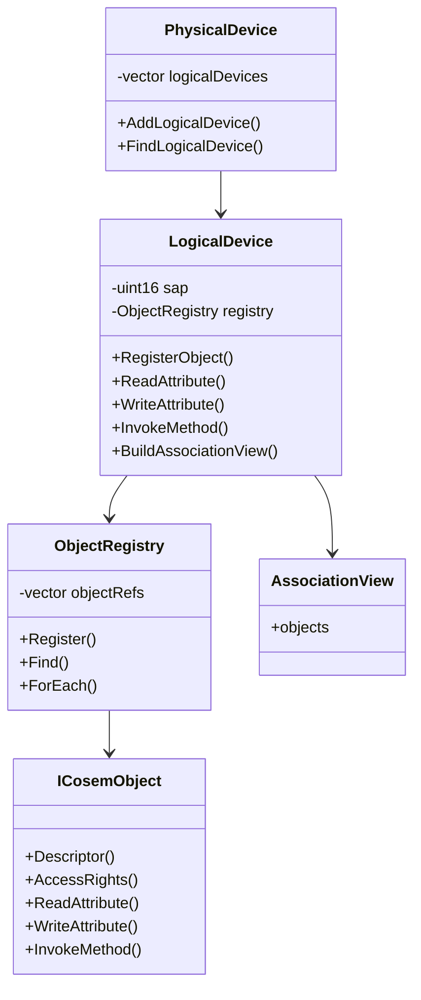
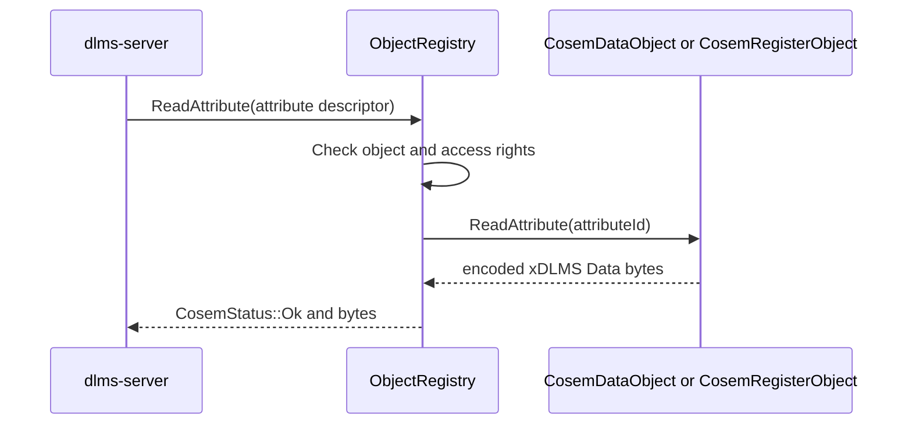
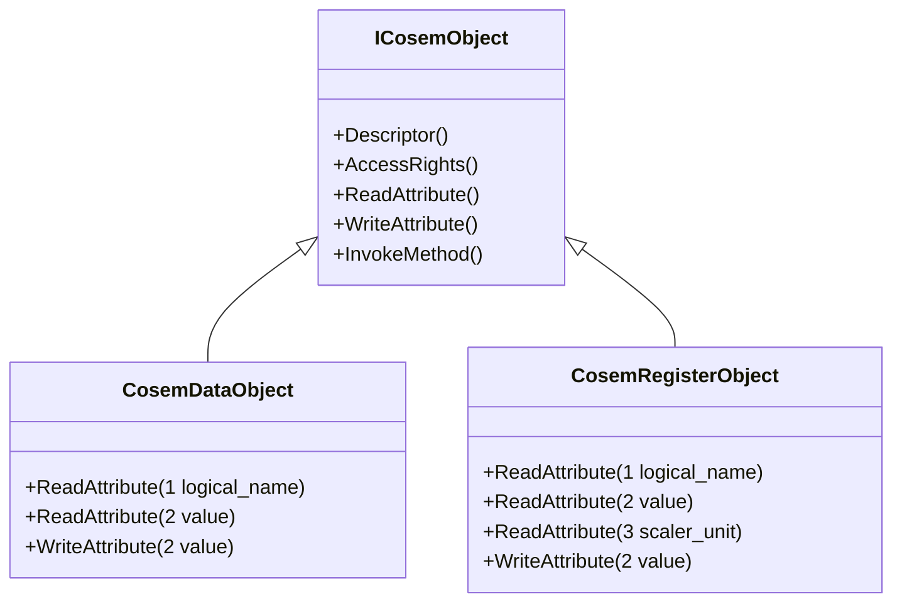
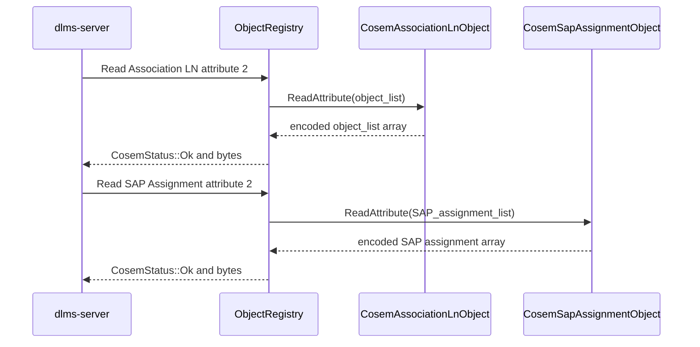

# dlms-cosem Architecture

## 1. Layer Position

`dlms-cosem` is below the server dispatcher and the xDLMS service layer. It
does not decode APDUs. It receives already resolved COSEM descriptors and
returns encoded xDLMS data bytes plus COSEM status values.

## 2. Read Attribute Flow

## 3. Association View Flow

## 4. Class Interaction

## 5. Ownership

The first implementation uses non-owning object references. Application or
server code owns concrete object instances. This keeps the registry simple and
avoids prescribing allocation policy before persistent object storage exists.

## 6. Error Model

The layer returns status codes only. Runtime API paths do not throw exceptions.
Object implementation failures are normalized to `ObjectError` unless they map
to a specific COSEM status.

## 7. Simple Interface Objects

The concrete objects stay inside `dlms-cosem` and implement only stable COSEM
interface-class behavior. They do not depend on `dlms-apdu`, `dlms-xdlms`, or
`dlms-server`; all attribute values remain encoded xDLMS Data byte vectors at
the layer boundary.

## 8. Association And SAP Discovery Objects

The discovery objects are snapshots. They receive `AssociationView` or
`SapAssignment` data from the owning logical or physical device and expose those
bytes through normal `ICosemObject` reads. Updating the object list after
registration requires constructing or refreshing the object explicitly; the
minimal object does not hold a mutable back-reference to the registry.
