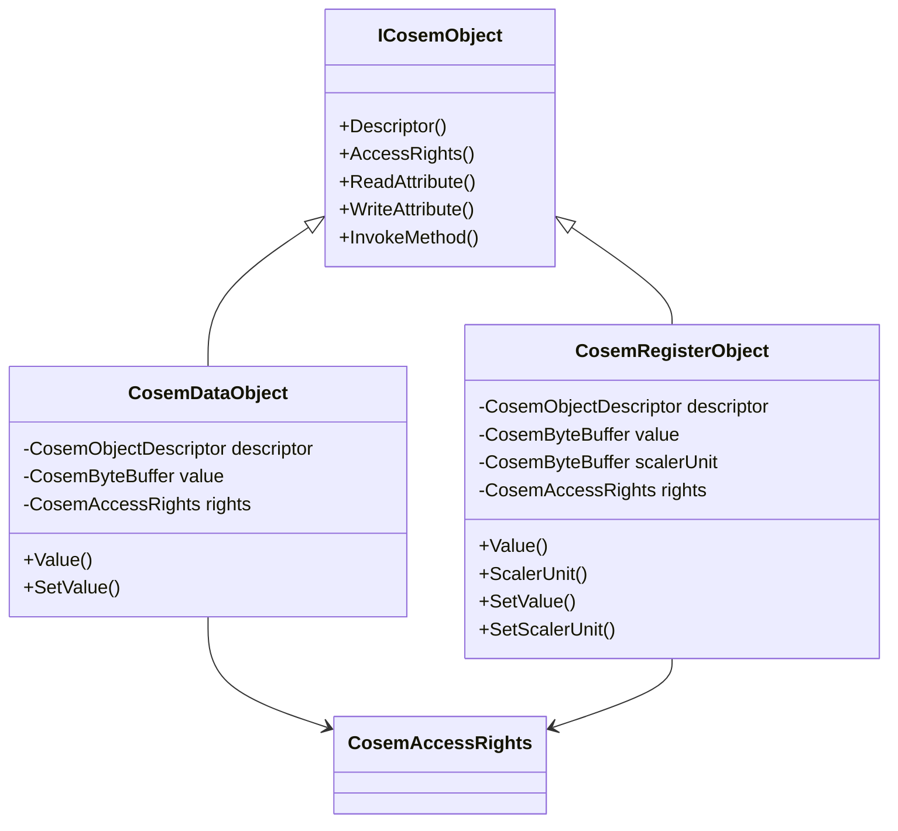
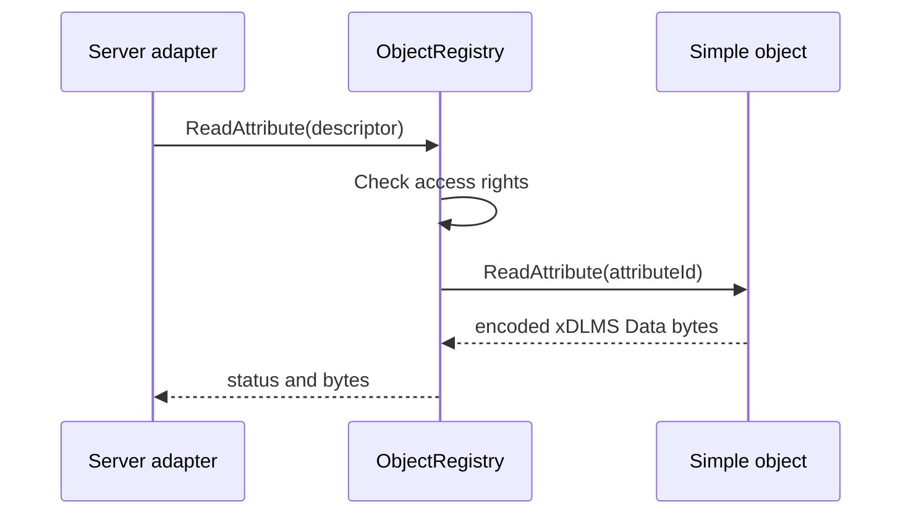

# Simple Interface Objects Plan

## 1. Scope

This phase adds the first reusable concrete COSEM interface objects to
`dlms-cosem`:

- Data, class id `1`, version `0`;
- Register, class id `3`, version `0`.

The objects are in-memory helpers for the MVP server path. They replace
test-only object implementations when a server needs simple readable or
writable values.

## 2. Requirements

1. The objects shall implement `ICosemObject`.
2. Constructors shall receive a logical name and encoded xDLMS Data byte
   vectors.
3. Data object attribute `1` shall return the logical name as encoded xDLMS
   Data octet-string bytes.
4. Data object attribute `2` shall return the stored encoded value.
5. Register object attribute `1` shall return the logical name as encoded xDLMS
   Data octet-string bytes.
6. Register object attribute `2` shall return the stored encoded value.
7. Register object attribute `3` shall return the stored encoded scaler-unit
   bytes.
8. Writes to attribute `2` shall update the stored value when registry access
   rights allow writes.
9. Writes to attribute `1` and Register attribute `3` shall return
   `AccessDenied` or `AttributeNotFound` according to the object's declared
   access contract.
10. Methods shall return `MethodNotFound`.
11. The objects shall not depend on `dlms-apdu`, `dlms-xdlms`, or
    `dlms-server`.

## 3. Non-Goals

- Typed COSEM value hierarchy.
- Profile Generic, Clock, Demand Register, or Association LN concrete classes.
- Persistent storage.
- Short-name referencing.
- Method behavior such as Register reset.

## 4. API

```cpp
#include "dlms/cosem/simple_objects.hpp"

dlms::cosem::CosemDataObject data(
  logicalName,
  encodedValue,
  dlms::cosem::AttributeAccessMode::ReadAndWrite);

dlms::cosem::CosemRegisterObject reg(
  logicalName,
  encodedValue,
  encodedScalerUnit,
  dlms::cosem::AttributeAccessMode::ReadOnly);
```

Both classes expose `Descriptor()`, `AccessRights()`, `ReadAttribute()`,
`WriteAttribute()`, and `InvokeMethod()` through `ICosemObject`.

## 5. Architecture





## 6. Test Plan

- descriptors use the expected class ids, versions, and logical names;
- attribute `1` returns encoded logical-name bytes;
- value attributes read the initialized encoded bytes;
- value writes update the stored bytes when access rights allow writes;
- denied writes do not change stored bytes when called through the registry;
- Register scaler-unit reads return the initialized bytes;
- unsupported attributes return `AttributeNotFound`;
- methods return `MethodNotFound`;
- objects can be registered in `ObjectRegistry` and used through registry
  read/write paths.
- invalid logical names are rejected by existing registry descriptor
  validation.

## 7. Phase Exit Criteria

Documentation phase is complete when this plan and the cross-linked
requirements/API/architecture/test-plan updates are committed.

Implementation phase is complete when standalone `dlms-cosem` tests pass and
the root submodule pointer is advanced.
