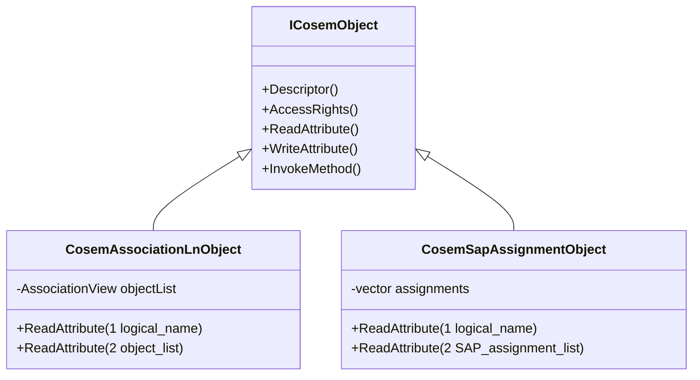
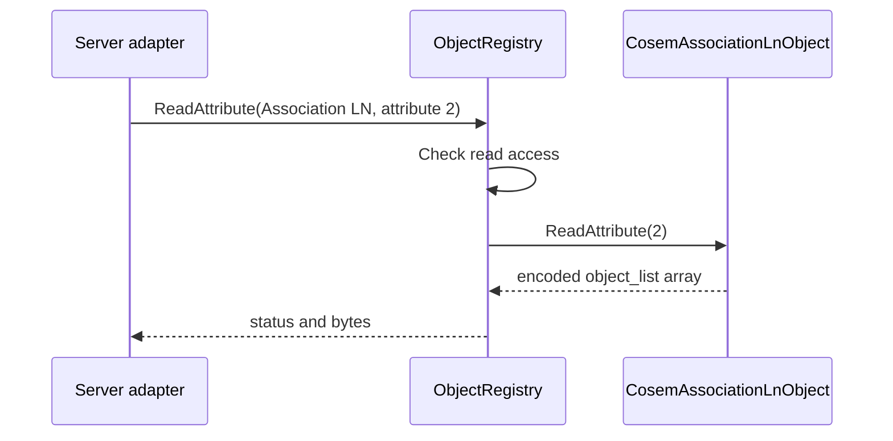

# Association Discovery Objects Plan

## 1. Scope

This phase adds minimal concrete discovery objects to `dlms-cosem`:

- Association LN, class id `15`, version `0`;
- SAP Assignment, class id `17`, version `0`;
- default logical-name helpers for Association LN, SAP Assignment, and Logical
  Device Name objects.

The goal is to expose enough of the mandatory server model for public-client
discovery and conformance smoke tests without implementing the complete
Association LN method set.

## 2. RAG Alignment

doc-rag references align the phase with the following stable model:

- Association LN class id `15`, version `0`, has `logical_name` and
  `object_list`; `object_list` contains visible objects with class id, version,
  logical name, and access rights.
- SAP Assignment class id `17`, version `0`, has `logical_name` and
  `SAP_assignment_list`; the list contains SAP and logical-device name pairs.
- The standard OBIS names are current Association `0.0.40.0.0.255`, SAP
  Assignment `0.0.41.0.0.255`, and Logical Device Name `0.0.42.0.0.255`.

## 3. Requirements

1. Association LN shall implement `ICosemObject`.
2. Association LN attribute `1` shall return the logical name as encoded xDLMS
   Data octet-string bytes.
3. Association LN attribute `2` shall return the object list as encoded xDLMS
   Data array bytes.
4. SAP Assignment shall implement `ICosemObject`.
5. SAP Assignment attribute `1` shall return the logical name as encoded xDLMS
   Data octet-string bytes.
6. SAP Assignment attribute `2` shall return the assignment list as encoded
   xDLMS Data array bytes.
7. Both objects shall be read-only.
8. Methods shall return `MethodNotFound`.
9. The implementation shall not depend on `dlms-apdu`.

## 4. Non-Goals

- Association LN HLS methods.
- Add/remove object and user methods.
- SAP `connect_logical_device`.
- Selective access for `object_list`.
- Live refresh through owning registry references.
- Full typed COSEM value model.

## 5. API

```cpp
CosemAssociationLnObject association(
  CurrentAssociationLnName(),
  logicalDevice.BuildAssociationView());

CosemSapAssignmentObject sapAssignment(
  SapAssignmentName(),
  physicalDevice.SapAssignments());
```

## 6. Architecture





## 7. Test Plan

- helper logical names return the expected OBIS bytes;
- descriptors use class ids `15` and `17`, version `0`;
- logical-name reads encode Data octet-string values;
- Association LN object-list read encodes all supplied objects;
- SAP Assignment list read encodes all supplied assignments;
- registry write attempts are rejected before mutating objects;
- unsupported attributes return `AttributeNotFound`;
- methods return `MethodNotFound`.

## 8. Phase Exit Criteria

Documentation phase is complete when this plan and cross-linked documentation
updates are committed.

Implementation phase is complete when standalone `dlms-cosem` tests pass and
the root submodule pointer is advanced.
