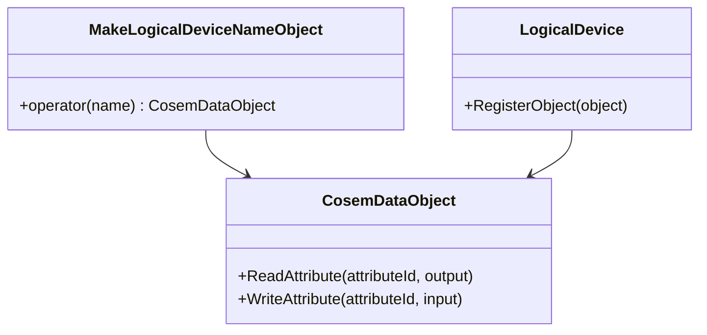
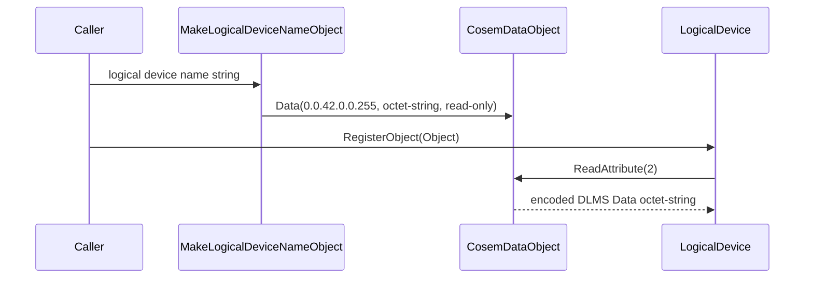

# Logical Device Name Object Plan

## 1. Scope

This phase adds a small helper for the standard COSEM Logical Device Name
object.

The object is represented by the existing `Data` interface class:

- class id: `1`
- version: `0`
- logical name: `0.0.42.0.0.255`
- value attribute: `2`

The value is encoded as DLMS Data `octet-string`. This matches the standard
choice of octet-string or visible-string while keeping the first implementation
inside the byte-oriented object model already used by `dlms-cosem`.

## 2. Requirements

1. `dlms-cosem` shall expose a helper for constructing a read-only Logical
   Device Name `Data` object.
2. The helper shall use `LogicalDeviceNameObjectName()` as the logical name.
3. Attribute `1` shall return the encoded logical-name octet-string through the
   existing `CosemDataObject` behavior.
4. Attribute `2` shall return an encoded DLMS Data octet-string containing the
   logical device name bytes supplied by the caller.
5. The helper shall not change `LogicalDevice` registration or ownership rules.

## 3. Architecture

## 4. Test Plan

- Unit test the helper descriptor:
  - class id is `1`;
  - version is `0`;
  - logical name is `0.0.42.0.0.255`.
- Unit test attribute `2`:
  - the result is DLMS Data octet-string;
  - the bytes match the supplied logical device name.
- Unit test access rights:
  - attribute `1` is read-only;
  - attribute `2` is read-only.

## 5. Phase Exit Criteria

Documentation phase is complete when this plan is committed in `dlms-cosem`.

Implementation phase is complete when `dlms-cosem` tests pass and the root
submodule pointer is advanced.
